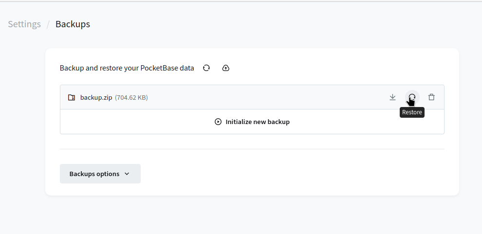
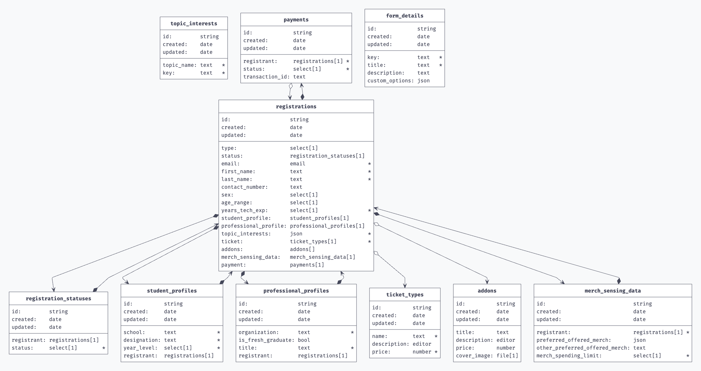

# DevFest Registration System
A custom-built registration system for the upcoming GDG Davao DevFest 2023.

## Features
- Admin dashboard for managing registrants / participants
- Screen registrants ("approve" and "reject")
- Ability to add and pick event "bundles"
- Handle e-wallet payments data
- Create summaries similar to Google Forms
- Send custom e-mails
- Generate certificates

## Development
### Stack
- PocketBase
- ViteJS
- ReactJS
- TypeScript
- shadcn/ui and react-hook-forms

### Prerequisites
- [PocketBase](https://pocketbase.io) 0.18.5 and above
- NodeJS (Either latest or LTS)

### Installation / Setup
#### Backend
1. Download PocketBase, and follow the [setup instructions](https://pocketbase.io/docs/).
2. Copy the `pb_hooks` folder in repo's `pb` directory into the current PocketBase installation directory. and restart the PocketBase server.
3. Go [`http://localhost:8090/_`](http://localhost:8090/_) (observe the `_`) and login. If not registered, use `example@example.com` and `1234567890` as e-mail and password when registering.
4. Go to `Settings -> Backups` and click the little cloud upload icon beside "Backup and Restore your PocketBase data". Upload the `backup.zip` file from the repo's `pb` directory and wait for it to upload.
5. Click the restore icon beside the name of the newly added backup. (Show on the picture below)
   
6. Type `backup.zip` and click "Restore Backup". And you're done!

> [!NOTE] If you are uploading an updated version of `backup.zip`, be sure to delete the existing backup.zip entry by clicking the trash can icon.

#### Frontend
1. Open a terminal pointing to the repo directory and execute `npm install`
2. Afterwards, execute `npm run dev` to start the app. Open your browser and go to [`https://localhost:5173`](https://localhost:5173) to see the web app.

### Schema

DRS is composed of multiple tables (or PocketBase "collections"):

| Collection Name | Explanation | Relies on | 
|-----------------|-------------|-----------|
| `bundles` | List of bundles to be available in the event. ||
| `form_details` | Metadata / information to be used for display on the registration forms. ||
| `payments` | Payment data of the registrants. | `registrations` |
| `professional_profiles` | Profile data of professional registrants. Only created if registrant is a `professional`. | `registrations` |
| `registrations` | A list of persons who registered for the event. ||
| `registration_statuses` | Registration statuses of the registrants if they are approved or rejected. | `registrations` |
| `slot_counter` | Virtual collection for displaying the number of slots for each registrant/participant type | `registrations` |
| `student_profiles` | Profile data of student registrants. Only created if registrant is a `student`. | `registrations` |
| `topic_interests` | List of topics to be chosen by the registrant. | `registrations` |

### Form Rendering
For flexibility, form fields are not "hard-coded" into the frontend app but are instead rendered dynamically by relying on the information provided by the backend server through the `/api/registration-fields` endpoint. This endpoint is a JSON array containing information compiled from the `registrations` collection schema which will also query the `form_details` collection if present. 

Once received, data is then fed into `FormFieldRenderer` component which will render the appropriate form input component based on the given field name and type. You may also provide and render custom form components by field. (See [TopicInterestFormRenderer](/src/components/form-renderers/TopicInterestFormRenderer))

## PocketBase Notes
### Custom backend API Endpoints
We utilize PocketBase's server hooks feature to create custom API endpoints similar to Firebase's custom functions.

Currently we only use it for getting registration fields list and registration slot counter. To add an endpoint, simply modify the `main.pb.js` inside `pb_hooks`. See PocketBase Server Hooks docs for details.

### Updating DB schema
When updating the database schema, be sure to update and commit the `src/pocketbase-types.ts` and `pb/pb_schema.json` files. To update `pocketbase-types.ts`, simply execute `npm run generate-types`. For `pb_schema.json`, copy the JSON text found in `Settings -> Export Collection` and paste it into `pb/pb_schema.json`.

## Resources
- [PocketBase Documentation](https://pocketbase.io/docs)
- [PocketBase JS Server Hooks Documentation](https://pocketbase.io/docs/js-overview/)
- [PocketBase JS Client Documentation](npmjs.com/package/pocketbase) (Can be also found on doc examples)
- [shadcn/ui Documentation](https://ui.shadcn.com/)
- [react-hook-forms Documentation](https://www.react-hook-form.com/)
- [react-router Documentation](https://reactrouter.com/)

### Copyright (c) 2023 GDG DevFest Davao Team